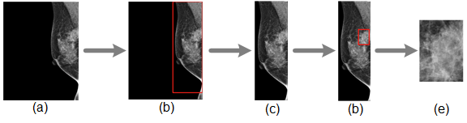

# Breast tumor detection from Mammogram images with YOLO
  
## 1. Introduction

This repo is for those who want to detect tumor from mammogram images (in DICOM format) with YOLO. 

      
    <em> 
    Figure 1. Examples of the cropping process. (a) The original image. (b) and (c) shows the removal of background. (d) and (e) illustrate the detection of breast tumor. 
    </em>

## 2. Getting Started

- ### Installation
    Install PyTorch and other dependencies. Download the weights ([link](https://drive.google.com/drive/folders/1aC62TZQrhGrYklkD-l0-dAd_tYBCc8WR?usp=drive_link)). The weights should be saved in `./yolo/yolo_weight/`.

- ### Dataset Preparation
    Put all DICOM files in `./data/`. We also provide two DICOM files as examples.

- ### Crop tumor from DICOM file
    Run `./crop_mammogram_tumor.py` to crop tumor from DICOM file. You can adjust the hyperparameters in `./yolo/inference.py`. The results will be saved in `./cropped/`, including the coordinate of the detection box in YOLO format.

## 3. References
- YOLO V5: [[HERE]](https://github.com/ultralytics/yolov5)
